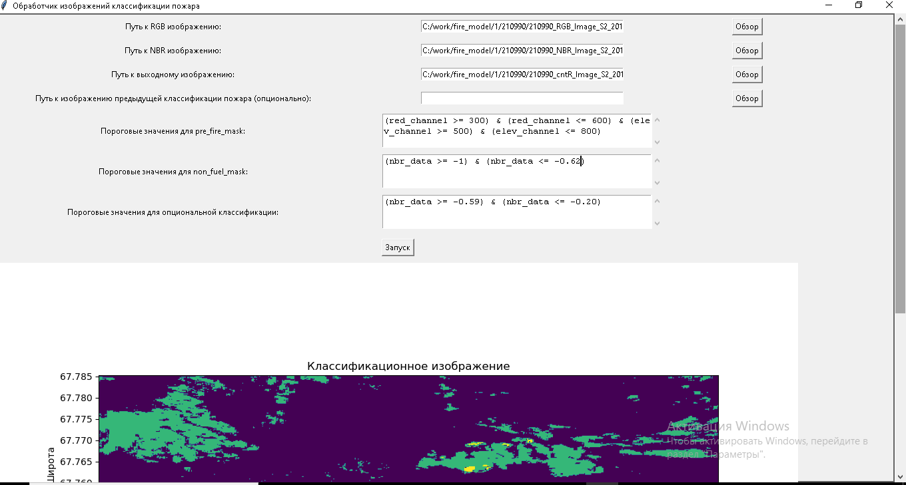
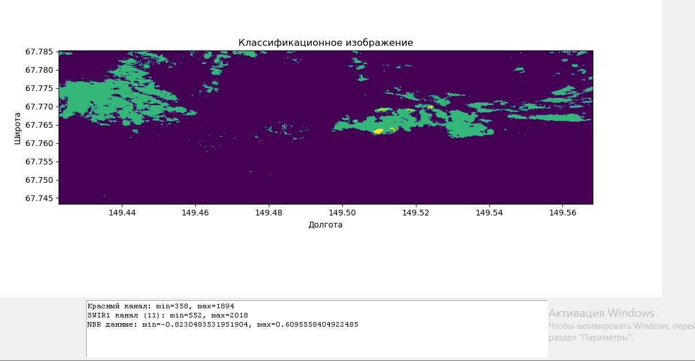

# Описание скрипта `classify.py`

Скрипт `classify.py` предназначен для классификации изображений пожаров с использованием данных RGB и NBR. Он предоставляет графический интерфейс пользователя (GUI) для удобного взаимодействия и визуализации результатов.

## Основные функции

### Интерфейс пользователя

Класс `FireClassificationApp` создает графический интерфейс пользователя с помощью библиотеки `tkinter`. Интерфейс позволяет пользователю выбрать файлы изображений, задать пороговые значения для классификации и запустить процесс обработки.

#### Основные элементы интерфейса:

1. Поля для ввода путей к RGB, NBR изображениям и выходному файлу.
2. Поле для ввода пути к изображению предыдущей классификации (опционально).
3. Поля для ввода пороговых значений для различных масок.
4. Кнопка запуска обработки.
5. Поле для отображения минимальных и максимальных значений каналов.
6. Графическое окно для отображения классифицированного изображения.

### Обработка изображений

Функция `process_images` выполняет основную обработку изображений. Она загружает изображения, применяет пороговые значения для создания масок и классифицирует области на основе данных RGB и NBR.

#### Основные шаги обработки:

1. **Загрузка изображений**:
   - Загрузка RGB и NBR изображений с использованием библиотеки `rasterio`.
   - Извлечение красного канала (красный) и канала SWIR1 (повышение) из RGB изображения.
   - Извлечение данных NBR из NBR изображения.

2.### Применение пороговых значений для масок:

- **Маска pre_fire** создается с использованием выражений на основе значений красного и SWIR1 каналов. Области, получают значение `-1`.
  ```python
  (red_channel >= 500) & (red_channel <= 1000) & (elev_channel >= 600) & (elev_channel <= 1300)
  ```

- **Маска non_fuel** создается на основе данных NBR. Области, попадающие под эту маску, получают значение `-3`.
  ```python
  (nbr_data >= -1) & (nbr_data <= -0.65)
  ```

- **Маска active_fire** определяет активные области пожара, где значения NBR больше 0. Эти области получают значение `0`.
  ```python
  nbr_data > 0
  ```

- **Дополнительная маска** используется для опциональной классификации на основе данных NBR. Области, попадающие под эту маску, получают значение `-1`.
  ```python
  (nbr_data >= -0.6) & (nbr_data <= -0.2)
  ```
     ```

3. **Обработка изображения предыдущей классификации**:
   - Если указан путь к изображению предыдущей классификации, области предыдущего пожара будут включены в итоговую классификацию.

4. **Обработка областей с отсутствующими данными**:
   - Области с отсутствующими данными в красном канале и NBR помечаются как `-3`.

5. **Визуализация результатов**:
   - Обновление текстовой информации о минимальных и максимальных значениях каналов.
   - Отображение классифицированного изображения на графическом окне.

6. **Сохранение результата**:
   - Сохранение выходного файла в формате GeoTIFF при подтверждении пользователя.

### Визуализация

Функции `update_min_max_text` и `update_plot` используются для обновления текстовой информации о минимальных и максимальных значениях каналов, а также для отображения классифицированного изображения на графическом окне.

## Применение

### Требования

- Python 3.x
- Библиотеки: `rasterio`, `numpy`, `tkinter`, `matplotlib`

### Запуск

1. Убедитесь, что все зависимости установлены.
2. Запустите скрипт:
    ```bash
    python classify.py
    ```
3. В графическом интерфейсе выберите необходимые файлы и задайте пороговые значения.
4. Нажмите кнопку "Запуск" для обработки изображений.
5. Проверьте результат на графическом окне и при необходимости сохраните его.

## Пример использования

1. Выберите путь к RGB изображению.
2. Выберите путь к NBR изображению.
3. Задайте путь к выходному файлу.
4. (Опционально) Выберите путь к изображению предыдущей классификации.
5. Задайте пороговые значения для масок.
6. Нажмите "Запуск".

Результат будет отображен в графическом окне. Если он удовлетворяет вашим требованиям, сохраните его.

## Детали реализации

### Интерфейс пользователя

Функция `setup_ui` создает графический интерфейс пользователя, включая поля для ввода путей к файлам, кнопки для обзора файлов и текстовые поля для ввода пороговых значений. Кнопка "Запуск" вызывает функцию `run_script`, которая запускает процесс обработки изображений.

### Обработка изображений

Функция `process_images` выполняет следующую последовательность действий:

1. **Загрузка RGB и NBR изображений**:
   - RGB изображение загружается и каналы извлекаются с использованием `rasterio`.
   - NBR изображение загружается аналогичным образом.

2. **Применение пороговых значений для масок**:
   - Маска pre_fire создается с использованием выражений на основе значений красного и SWIR1 каналов.
   - Маска non_fuel создается на основе данных NBR.
   - Маска active_fire определяет активные области пожара, где значения NBR больше 0.
   - Дополнительная маска используется для опциональной классификации на основе данных NBR.

3. **Обработка изображения предыдущей классификации**:
   - Если указано изображение предыдущей классификации, маска пожара из этого изображения объединяется с текущей классификацией.

4. **Обработка областей с отсутствующими данными**:
   - Все области с отсутствующими данными в красном канале и NBR помечаются как `-3`.

5. **Визуализация и сохранение**:
   - Текстовая информация о минимальных и максимальных значениях каналов обновляется.
   - Классифицированное изображение отображается на графическом окне.
   - Если результат удовлетворителен, пользователь может сохранить его в формате GeoTIFF.

## Скриншоты

Пример работы скрипта с визуализацией результатов:

Ввод входных данных:


Окно визуализации:


Итоговое изображение:


