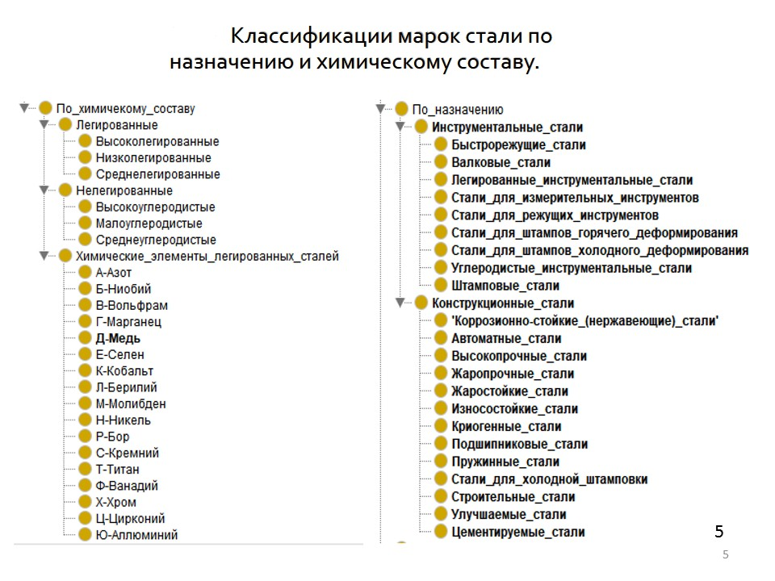

## Gost&MaterialsAppProject 

Представляет собой комплексное решение для сбора, обработки и представления данных о ГОСТах и сплавах в виде Android-приложения. Проект объединяет инструменты парсинга, API для доступа к данным и само мобильное приложение.

## data_extractor

data_extractor содержит инструменты для извлечения и обработки данных.

Api.py: Flask-приложение, предоставляющее API для доступа к данным о ГОСТах и сплавах. Приложение также позволяет загрузить файлы для дальнейшего анализа и обработки.
controller/Parser.py: Класс Parser, использующий библиотеки BeautifulSoup и requests для парсинга веб-страниц. Отвечает также за загрузку данных о ГОСТах и сплавах из JSON-файлов.
data:
gosts.json: Содержит данные о ГОСТах.
materials.json: Содержит данные о сплавах.

## gosts_and_materials

gosts_and_materials — это Android-приложение, созданное на Kotlin.

Приложение состоит из:
Main Activity: Главный экран приложения, на котором представлен список ГОСТов и сплавов.
Detail Activity: Экран детализации, предоставляющий подробную информацию.
Database: Внутренняя база данных приложения, содержащая все данные.
Adapters: Классы, которые используются для отображения списков на главном экране.

## Ознакомительная презентация

