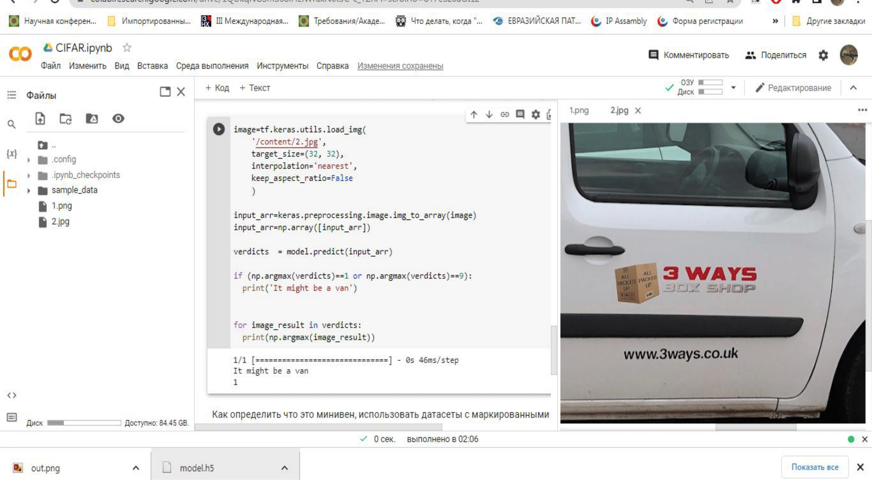
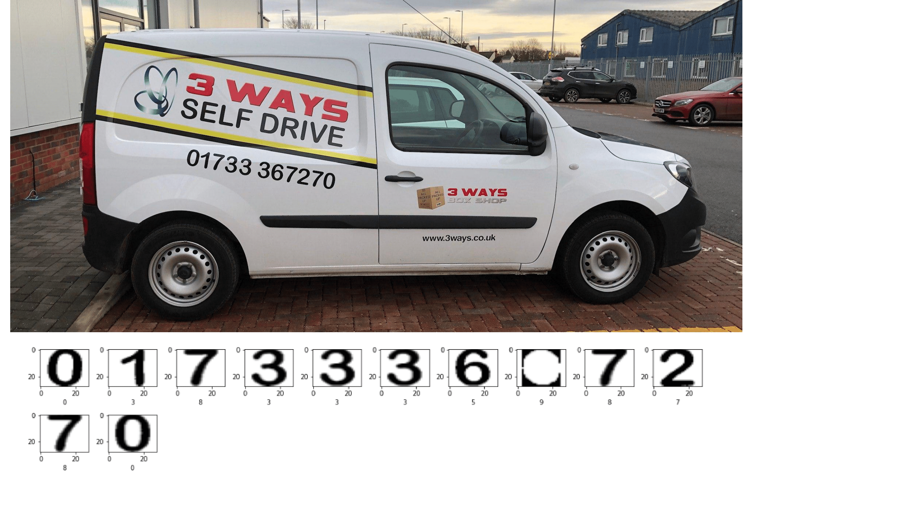
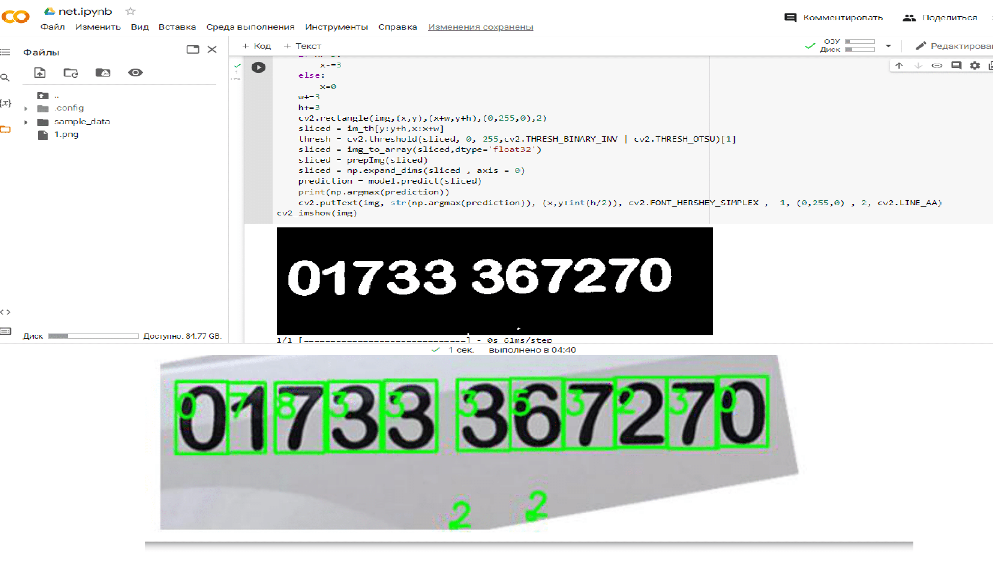

# Проекты по нейросетям

Этот каталог содержит различные проекты, связанные с нейросетями и глубоким обучением. Ниже приведены описания каждого проекта.

## Классификация изображений CIFAR-10 (`cifar.py`)

> **Ссылка на Google Colab:** [https://colab.research.google.com/drive/1QUkqNGSmS68iHEiWRIkN0t3C-c_TZnFf?usp=sharing]

\`\`\`
В этом проекте используется сверточная нейросеть (СНС) для классификации изображений из набора данных CIFAR-10. Изображения относятся к 10 различным классам, таким как автомобили, птицы, собаки и т.д. Для создания и обучения модели используется TensorFlow.
\`\`\`

## Сегментация изображений (`img.py`)

> **Ссылка на Google Colab:** [https://colab.research.google.com/drive/1iCQx62ywVoqtlCTRNgVmzYrlgEt9PUWW?usp=sharing]

\`\`\`
Этот проект использует TensorFlow и OpenCV для сегментации изображений. Загружается предварительно обученная модель и применяется к различным изображениям для распознавания или сегментации объектов.
\`\`\`

## Анализ отзывов IMDb (`newlstm.py`)

> **Ссылка на Google Colab:** [https://colab.research.google.com/drive/1zkDRNEyGu-I-iU0avBZmVYT9euY77zpd?usp=sharing]

\`\`\`
В этом проекте используются сети с долгосрочной памятью (LSTM) для классификации отзывов IMDb как положительных или отрицательных. Для создания и обучения модели используется библиотека TensorFlow.
\`\`\`

## Операции с тензорами (`net.py`)

> **Ссылка на Google Colab:** [https://colab.research.google.com/drive/1SBNxzS8twORbT-hrezaC4Okw3h0S_hAy?usp=sharing]

\`\`\`
Этот проект служит вводным руководством по базовым операциям с тензорами с использованием TensorFlow. Он не решает конкретную проблему, но предоставляет основные знания по операциям с TensorFlow.
\`\`\`

## Ознакомительные скриншоты

