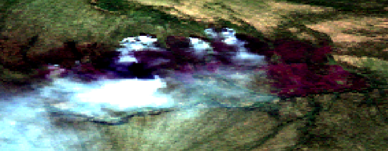
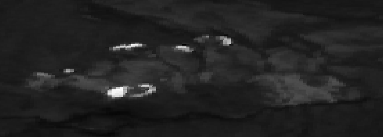
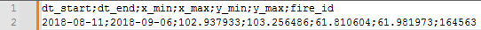

# Описание проекта

Этот репозиторий содержит четыре скрипта для обработки спутниковых изображений с использованием Google Earth Engine (GEE). Скрипты предназначены для загрузки, фильтрации и экспорта изображений Sentinel-2 и Landsat 8/9. Эти скрипты помогут получить изображения до и после пожара в различных форматах (RGB(псведо-RGB - пожарный синтез, при необходимости в скрипте можно заменить SWIR канал на зеленый (B4,B11,B2) и NBR/NBR+), а также дополнительные изображения через определенный период времени.

## Содержание

- [all_sentinel.py](#all_sentinelpy)
- [sentinel_load.py](#sentinel_loadpy)
- [all_landsat_8_9.py](#all_landsat_8_9py)
- [landsat_8_9.py](#landsat_8_9py)
- [Скриншоты](#скриншоты)

## all_sentinel.py

### Описание

Скрипт предназначен для работы с изображениями Sentinel-2(коллекцию можно поменять при необходимости). Он загружает и фильтрует коллекцию изображений на основе координат и временных интервалов, заданных в CSV файле. Скрипт скачивает пары изображений в формате RGB и NBR+, а также одно дополнительное изображение через 20 дней после окончания указанного периода. Разрешение изображений составляет 20 метров на пиксель.

### Основные функции

- `load_and_filter_image_collection(row)`: Загружает и фильтрует коллекцию изображений Sentinel-2.
- `calculate_nbr(image)`: Рассчитывает индекс NBR+ (https://www.mdpi.com/2072-4292/14/7/1727).
- `export_image(image, index, description_prefix, geometry, image_type)`: Экспортирует изображения в формате GeoTIFF (RGB и NBR+).
- `process_images_from_table(file_path)`: Обрабатывает изображения на основе данных из CSV файла, экспортируя пары изображений (RGB и NBR+) и одно дополнительное изображение через 20 дней после окончания периода в GoogleDrive.

### Использование

```python
process_images_from_table(r"C:\fire\GEE_fire_2.csv")
```

## sentinel_load.py

### Описание

Этот скрипт также работает с изображениями Sentinel-2, но включает функцию `select_images`, которая выбирает до четырех изображений, обеспечивая, чтобы разница между ними не превышала трех дней для лучшей визуализации динамики пожара. Скрипт также экспортирует дополнительные изображения через 20 дней после окончания периода. Разрешение изображений составляет 20 метров на пиксель.

### Основные функции

- `load_and_filter_image_collection(row)`: Загружает и фильтрует коллекцию изображений Sentinel-2.
- `calculate_nbr(image)`: Рассчитывает индекс NBR+.
- `export_image(image, index, description_prefix, geometry, image_type)`: Экспортирует изображения в формате GeoTIFF (RGB и NBR+).
- `select_images(image_list, max_images=4, max_days_between=3)`: Выбирает до четырех изображений с минимальным интервалом между ними.
- `process_images_from_table(file_path)`: Обрабатывает изображения на основе данных из CSV файла, экспортируя пары изображений (RGB и NBR+) и одно дополнительное изображение через 20 дней после окончания периода.


## all_landsat_8_9.py

### Описание

Скрипт предназначен для работы с изображениями Landsat 8 и 9. Он загружает и фильтрует коллекции изображений, рассчитывает индекс NBR и экспортирует пары изображений (RGB и NBR). Также скрипт экспортирует одно дополнительное первое изображение из списка в дипазоне  50 дней после окончания указанного периода. Разрешение изображений составляет 30 метров на пиксель.

### Основные функции

- `load_and_filter_image_collection(row)`: Загружает и фильтрует коллекции изображений Landsat 8 и 9.
- `calculate_nbr(image)`: Рассчитывает индекс NBR.
- `export_image(image, index, description_prefix, geometry, image_type)`: Экспортирует изображения в формате GeoTIFF (RGB и NBR).
- `process_images_from_table(file_path)`: Обрабатывает изображения на основе данных из CSV файла, экспортируя пары изображений (RGB и NBR) и одно дополнительное изображение через 50 дней после окончания периода.


## landsat_8_9.py

### Описание

Этот скрипт аналогичен `all_landsat_8_9.py`, но также включает функцию `select_images`, которая выбирает до четырех изображений с минимальным интервалом между ними. Скрипт также экспортирует одно дополнительное изображение, первое в списке изображений из дипазона dt_end;dt_end+50days. Разрешение изображений 30 метров на пиксель.

### Основные функции

- `load_and_filter_image_collection(row)`: Загружает и фильтрует коллекции изображений Landsat 8 и 9.
- `calculate_nbr(image)`: Рассчитывает индекс NBR.
- `export_image(image, index, description_prefix, geometry, image_type)`: Экспортирует изображения в формате GeoTIFF (RGB и NBR).
- `select_images(image_list, max_images=4, max_days_between=3)`: Выбирает до четырех изображений с минимальным интервалом между ними.
- `process_images_from_table(file_path)`: Обрабатывает изображения на основе данных из CSV файла, экспортируя пары изображений (RGB и NBR) и одно дополнительное изображение через 50 дней после окончания периода.


## Скриншоты

Ниже приведены скриншоты, демонстрирующие работу скриптов и пример CSV файла.

Пример RGB(пожарный синтез) изображения Sentinel-2:


Пример изображения NBR+ Sentinel-2:


Пример CSV файла:


Входной CSV файл. Можно добавлять необходимое количество столбцов.
