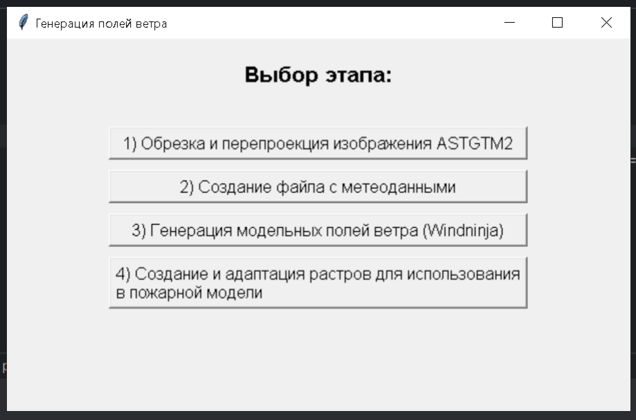

# Описание скриптов для обработки данных о ветре

## 1. `wind_generator_tkinter.py`

Приложение с графическим интерфейсом для обработки и генерации данных о ветре. В этом приложении объединены функции скриптов `aster_cut.py`, `utm.py`, `get_cache_wind.py`, `wind_to_fires_parse.py`, `windninja.py`, `json_rasterize.py` и `wsg_84.py`, что позволяет выполнять все этапы обработки данных в одном интерфейсе.

### Основные этапы:

1. **Обрезка и перепроекция изображений ASTGTM2**.
2. **Создание файла с метеоданными**.
3. **Генерация модельных полей ветра (WindNinja)**.
4. **Создание и адаптация растров для использования в модели**.

### Интерфейс пользователя:

- Поля для ввода путей к изображениям, папкам и файлам.
- Кнопки для выбора директорий и запуска процессов.
- Лог для отображения текущего состояния и ошибок.

## 2. `aster_cut.py`

Скрипт для обрезки и объединения растровых изображений по заданным границам.

### Основные функции:

- Получение границ растрового изображения.
- Поиск файлов ASTER, которые пересекаются с заданными границами.
- Объединение найденных файлов ASTER.
- Обрезка объединенного изображения по границам.
- Сохранение результата в формате GeoTIFF.

## 3. `utm.py`

Скрипт для преобразования TIFF-файлов в координатную систему UTM.

### Основные функции:

- Определение зоны UTM на основе координат.
- Перепроекция изображений в соответствующую зону UTM.
- Сохранение перепроецированных изображений в формате TIFF.

## 4. `get_cache_wind.py`

Скрипт для извлечения данных о ветре из кэш-файлов и сохранения их в CSV.

### Основные функции:

- Извлечение данных о ветре из JSON-файлов.
- Фильтрация данных по времени.
- Поиск ближайшего и последнего по времени изменения кэш-файла.
- Сохранение отфильтрованных данных в CSV.

## 5. `wind_to_fires_parse.py`

Скрипт для фильтрации данных о ветре по времени и сохранения их в новые CSV-файлы.

### Основные функции:

- Фильтрация данных по времени на основе диапазона дат.
- Сохранение отфильтрованных данных в новый CSV файл.

## 6. `windninja.py`

Скрипт для запуска модели WindNinja для расчета полей ветра и сохранения результатов. https://www.firelab.org/project/windninja - для загрузки WindNinja.

### Основные функции:

- Запуск модели WindNinja с заданными параметрами.
- Сохранение результатов в заданную папку.

## 7. `json_rasterize.py`

Скрипт для преобразования файлов .asc в TIFF и сохранения данных о ветре в JSON.

### Основные функции:

- Чтение данных о ветре из CSV файла.
- Поиск файлов .asc, соответствующих данным о ветре.
- Преобразование найденных файлов .asc в TIFF.
- Сохранение результатов в JSON.

## 8. `clean_asc_prj.py`

Скрипт для удаления ненужных файлов из папок, оставляя только нужные .tif и .prj файлы.

### Основные функции:

- Загрузка JSON файла с данными.
- Определение списка нужных файлов.
- Удаление ненужных файлов из папки.

## 9. `change_json_tifpaths.py`

Скрипт для обновления путей к TIFF-файлам в JSON-файлах.

### Основные функции:

- Поиск JSON файлов в заданной папке.
- Обновление путей к TIFF-файлам в JSON.
- Сохранение измененных JSON файлов.

## 10. `wsg_84.py`

Скрипт для конвертации TIFF-файлов в координатную систему WGS84.

### Основные функции:

- Конвертация изображений в формат WGS84.
- Сохранение результатов в формате TIFF.

## 11. `add_windpath_tobat.py`

Скрипт для добавления путей к JSON-файлам ветра в bat файлы.

### Основные функции:

- Чтение данных о пожарах из текстового файла.
- Обновление путей к JSON-файлам в bat файлах.
- Сохранение обновленных bat файлов.

## 12. `create_shp.py`

Скрипт для создания векторных файлов (.shp) из изображений.

### Основные функции:

- Чтение данных из растровых изображений.
- Преобразование растровых данных в векторные.
- Сохранение результатов в формате .shp.

Эти скрипты можно запускать отдельно в указанном порядке, изменяя в них пути к папкам. CSV файлы для этапа 7 обязательно должны находиться в папке `filtered`, которая создается после выполнения этапов 4 и 5 (или этапа 2 в приложении с интерфейсом).

## Скриншоты

Пример работы скрипта с визуализацией результатов:

Интерфейс wind_generator_tkinter.py:

